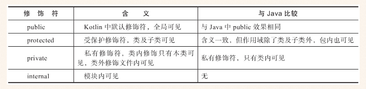

# kotlin学习笔记

------

**Kotlin** 是运行在jvm虚拟机上的一种静态编程语言。可以和java语言互操作！

## 基础语法

?在变量后表示该变量可为null
?在语句中表示安全条用

------

## 表达式和语句

表达式是可以求值的语句。如if语句、when语句、try语句，在kotlin中都是表达式。

------

## Lambda表达式

Lambada表达式本质是一种语法糖，简化匿名函数的书写

------

## 面向对象

Kotlin 中去掉了 new 关键字
Kotlin 使用 : 代替 extends 和 implement
Kotlin 中 方法和类 默认是被final修饰的，加上 open 关键字可去掉 final

### 可见性修饰符

> * Kotlin中方法和类默认是 public 的
> * Kotlin中新加 internal 修饰符，**项目内访问**，只有同一个项目的类可以访问
> * Kotlin中方法和常量 可以定义在文件中，类不是必须的
> * Kotlin中 protected 代表类和子类可以访问，同一个 package 内的类不能访问

### 继承
Kotlin 和 java 一样，单继承多实现